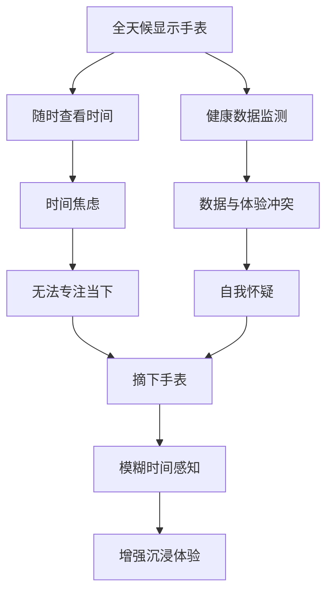
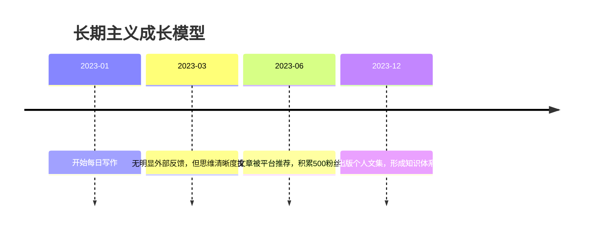
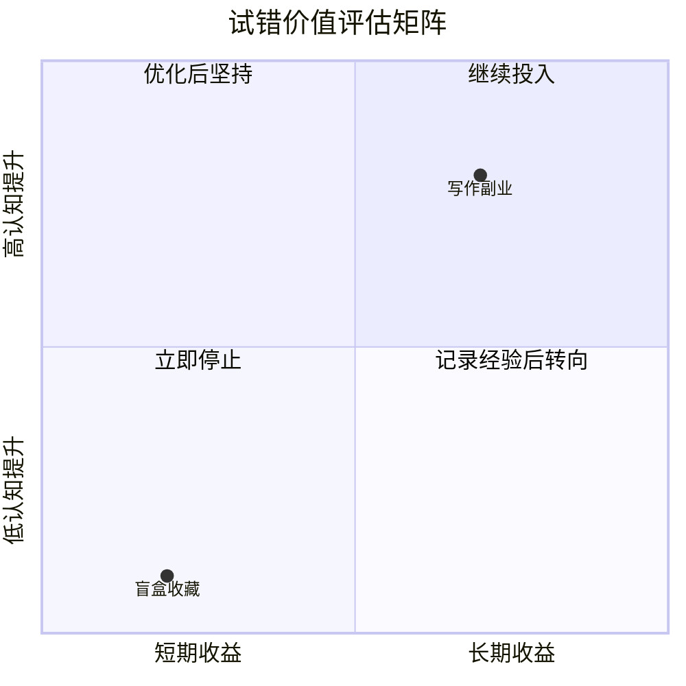

## 🧑‍💻 User

https://sspai.com/post/101302
这篇文章还挺有意思的，帮我总结下

---
## 🤖 doubao-seed-1-6-250615

  

    
已深度思考

    我现在需要处理用户的请求，总结一篇来自sspai.com的文章，链接是https://sspai.com/post/101302。首先，我得确认用户的需求是什么。用户说这篇文章有意思，让帮忙总结，所以我需要按照之前提供的结构来组织输出：摘要、核心内容、可执行建议、问答环节。  首先，我需要获取文章的内容。因为用户提供了URL，所以必须使用可用的工具来获取文章内容。根据提供的工具列表，有tool_cherry-fetch_html、tool_cherry-fetch_markdown、tool_cherry-fetch_txt和tool_cherry-fetch_json。考虑到要总结文章，最好获取纯文本内容，这样更容易处理，所以应该选择tool_cherry-fetch_txt，因为它返回的是没有HTML标签的纯文本，适合后续分析。  接下来，检查工具参数是否正确。工具需要url参数，用户已经提供了链接，所以直接使用这个URL作为参数。不需要headers，所以可以忽略headers参数。确认之前没有调用过这个工具，因为这是第一次处理这个请求，所以符合规则4，不会重复调用。  然后，生成工具调用的格式。按照要求，使用XML标签，name设为tool_cherry-fetch_txt，arguments是{&quot;url&quot;: &quot;https://sspai.com/post/101302&quot;}。确保格式正确，没有使用变量，直接填入URL值。  调用工具后，应该会得到文章的纯文本内容。之后，我需要根据这个内容来完成摘要、核心内容、可执行建议和问答环节。但现在的步骤是先获取内容，所以当前只需要调用fetch_txt工具，获取结果后再进行下一步分析。  检查是否有必要调用工具：是的，因为需要文章内容才能总结，无法凭记忆或现有知识完成，所以必须调用工具。符合规则2，只在需要时调用工具。  最后，确保回复中包含工具调用，并且格式正确。不需要其他工具，比如dummy-server-think，因为当前阶段只是获取数据，不需要复杂推理。所以现在只需要调用tool_cherry-fetch_txt工具，等待返回结果后再继续处理。  现在需要处理用户的请求，用户提供了一篇来自少数派的文章链接，并要求总结这篇文章。首先，我需要确认用户的需求是按照特定的结构来组织输出，包括摘要、核心内容、可执行建议和问答环节。  首先，用户已经提供了文章的文本内容，所以不需要再调用工具来获取文章内容。接下来，我需要仔细阅读并理解文章的主要内容，然后按照用户要求的结构进行整理。  文章的主题是关于耐心的重要性，作者通过三个故事展开讨论：第一个故事关于Apple Watch的意外损坏，导致作者反思时间焦虑和量化自我的数据与真实体验的冲突；第二个故事关于倾听和长期主义，讨论如何在浮躁的时代保持耐心；第三个故事关于试错和资源配置，强调允许自己犯错的重要性。  接下来，我需要按照结构分解内容：  1. **摘要**：需要3-5句话概述核心主题和重要性。文章主要讨论耐心在现代社会中的重要性，通过个人故事探讨时间焦虑、长期主义和试错的价值，指出耐心有助于缓解焦虑，促进长期成长。  2. **核心内容**：分解为三个主要部分，每个部分有要点、方法和视觉表示。可能需要使用mermaid图表来展示耐心与时间焦虑、长期主义、试错之间的关系。  3. **可执行建议**：提取具体的行动步骤，如尝试无手表日、实践呼吸冥想、预留试错时间和金钱等。  4. **问答环节**：生成3-5个问题，如“如何缓解时间焦虑？”、“长期主义如何帮助个人成长？”等，并提供简明解答。  需要注意避免冗长，保持逻辑清晰，使用适当的标题和编号。同时，确保语言直接、专业，符合用户指定的语气。  现在检查是否需要调用工具：用户已经提供了文章内容，因此不需要使用fetch工具。不需要搜索或计算，因此无需其他工具。直接整理内容即可。  最后，按照结构组织回复，确保每个部分符合要求，并使用mermaid图表来阐明关系。例如，用流程图展示耐心、时间焦虑、长期主义、试错之间的联系。
  

# 关于耐心的思考：在浮躁时代寻找内心平静与长期成长

## 1. 摘要（Summary）
本文通过三个个人故事探讨了“耐心”在现代社会中的重要性。作者以Apple Watch使用体验反思时间焦虑与量化数据对真实体验的干扰，通过对话习惯分析浮躁时代的倾听缺失，结合试错经历强调长期主义的价值。核心观点指出：耐心是对抗焦虑的关键，通过接纳不可量化的成长、预留试错空间和坚持长期行动，人们能在快速变化的世界中获得内心平静与持续进步。文章呼吁读者以“种一棵树”的心态看待成长，在宇宙尺度下消解虚无主义，专注当下的可控行动。

## 2. 核心内容（Core Content）

### 2.1 时间焦虑：当量化自我与真实体验冲突
- **关键要点**：全天候显示手表和健康数据监测工具加剧了对“时间精确性”和“数据完美性”的过度关注，导致人们脱离当下体验，产生自我怀疑和效率焦虑。
- **作者建议**：关闭非必要的量化功能（如洗手检测），定期体验“无手表日”，通过模糊时间感知增强当下沉浸感。
- **视觉表示**：

### 2.2 长期主义：对抗时代浮躁的生存策略
- **关键要点**：短视频文化削弱了人们的倾听耐心和延迟满足能力，而个人成长如同植物生长，需要以“90天-180天”为周期观察变化，而非每日紧盯结果。
- **作者建议**：通过呼吸冥想缓解即时焦虑，用“宇宙尺度思维”消解虚无主义，关注不可量化的成长指标（情绪管理、顿悟时刻、技能提升）。
- **视觉表示**：

### 2.3 试错空间：为成长预留资源缓冲带
- **关键要点**：现代教育过度强调“不犯错”，导致人们害怕失败；实际上，人生需要像配置资产一样预留“试错资源”，包括时间和金钱的弹性空间。
- **作者建议**：
 - **时间资源**：将工作日晚上设为“无目标探索期”，允许未完成计划
 - **金钱资源**：配置总资产10%作为“高风险试错金”，用于学习新技能或创业尝试
 - **旅行策略**：放弃完美打卡心态，预留30%行程空白时间应对意外发现

## 3. 可执行建议（Actionable Advice）

### 3.1 日常耐心训练三步法
1. **呼吸锚定练习**：每天花5分钟进行“4-7-8呼吸法”（吸气4秒→屏息7秒→呼气8秒），将注意力从焦虑思维转移到生理感受
2. **时间感知实验**：每周选择1天不携带手表/手机，记录“无时间工具时的专注时长变化”
3. **微小坚持计划**：选择1项长期目标（如写作/健身），设定“最小行动单位”（如每天写50字/做1个俯卧撑），坚持90天后对比变化

### 3.2 试错资源配置清单
- **时间缓冲带**：在日程表中每天预留1小时“空白时段”，不安排任何任务
- **金钱试错池**：每月将收入的5%存入“探索基金”，用于报名未知领域课程或体验新活动
- **社交实验田**：每季度主动与1位观点不同的人深度对话，练习“先倾听后回应”（忍住前3秒插话冲动）

## 4. 问答环节（Q&A Section）

### Q1: 如何区分“耐心”与“拖延”的界限？
A: 核心差异在于“行动方向”。耐心是“持续微小行动+接受缓慢反馈”（如每天背5个单词），拖延是“无行动+焦虑性等待”。可通过“5分钟启动法则”检验：若能立即开始最小行动且不抗拒，则为耐心；若大脑编造理由逃避开始，则为拖延。

### Q2: 量化数据工具（如运动手表）是否应该完全弃用？
A: 建议“选择性使用”。保留能真正提升体验的功能（如睡眠周期闹钟），关闭引发焦虑的功能（如实时运动数据排名）。记住“工具服务于人”，当数据让你怀疑自身感受时，优先级永远是“真实体验>数字指标”。

### Q3: 面对他人的“速成成功”，如何保持长期主义心态？
A: 运用“时间望远镜思维”：
① 询问自己“这个成就者是否有5年以上相关积累？”（多数成功存在前置沉默期）
② 制作“个人成长时间轴”，标注过去3年的关键突破节点，可视化自己的积累轨迹
③ 设定“不可比较领域”，如“我的独特生活体验”“家庭关系质量”等无法被他人超越的维度

### Q4: 试错过程中如何避免陷入“无意义的浪费”？
A: 建立“试错-反思”闭环：每次尝试前明确“最小验证目标”（如“测试这个副业能否在3个月内产生正向现金流”），结束后用“2×2矩阵”评估：

### Q5: 呼吸冥想为何能提升耐心？
A: 生理层面，深呼吸激活副交感神经（“休息-消化”模式），降低肾上腺素水平；心理层面，专注呼吸训练“延迟反应能力”——当你能忍住不立即关注外界刺激（如手机通知），就能更从容面对成长中的不确定性。建议从每天2分钟开始，逐步延长至10分钟。

---
## 🧑‍💻 User

这篇文章对我来说也是蛮有用的，特别是里面很多点都可以探讨，所以我想和你深入讨论下。先聊聊「量化自我的数据」与「真实自我的体验」，这里的量化我的数据我还是挺有感触的，尽管我没有像其他人那样写todo，但我目前会记录时间块（用日程记录做什么事花了多久）。这个行为我觉得没有什么不好的，或者说我觉得是有意义的，但问题在于什么呢，回顾的时候看到很长时间在娱乐（比如刷短视频）就很难受，会有种浪费时间的感觉，会想着学点东西啥的，但确实很难去行动。

---
## 🤖 Gemini 2.5 Flash

  

    
已深度思考

    **Analyzing the Core Issue**  I&#39;m currently focused on deconstructing the user&#39;s core problem, which involves time logging. My initial thoughts are centered on understanding the nuances of how the user records their time and the potential discrepancies between &quot;quantified self&quot; data and their subjective experiences. I&#39;m aiming to identify the key pain points related to this time-tracking process.   **Exploring the Discomfort**  I&#39;m now digging deeper into the &quot;discomfort&quot; the user experiences when viewing their entertainment time. I believe it is critical to explore this feeling. Is it simply guilt? Or, is it also a sense of failure because they feel they are not reaching their goals? I&#39;m focusing on the disconnect between the desire to learn and the reality of their time spent on entertainment. What are the key elements to consider?  **Refining the Framework**  I&#39;m now integrating insights from the &quot;quantified self&quot; article into the framework. My focus has shifted to the user&#39;s reaction to their time log data. I believe the discomfort stems from a negative interpretation of entertainment time, rather than the activity itself. I&#39;m exploring how to help the user reframe this data for more positive outcomes. I&#39;m building on the value of tracking time by emphasizing awareness.   **Reflecting on Initial Feelings**  I&#39;m now unpacking the initial &quot;meaningful&quot; feeling the user has for time-tracking, acknowledging it as a valid starting point. The core conflict is a negative emotional response to entertainment time within the log. I&#39;m exploring reframing the data and building in small, actionable learning steps, drawing from the &quot;quantified self&quot; article. I&#39;ll focus on intentionality and the value of rest.   **Exploring Emotional Responses**  I&#39;m now focusing on how the user&#39;s emotions shape their interpretation of the time log data. The goal is to acknowledge and validate this emotional response. The discomfort linked to perceived &quot;waste&quot; and entertainment time feels linked to the article&#39;s theme of &quot;time anxiety.&quot; This suggests a need to reframe these concepts. I&#39;m aiming to help the user manage these emotions around &quot;guilt&quot; and &quot;wasted time.&quot;   **Revising and Refining Strategies**  My focus has shifted to constructing actionable strategies, specifically around reframing entertainment, establishing mindful boundaries, and lowering the barriers to learning. I&#39;m prioritizing methods to foster awareness and intentionality, all while maintaining a supportive and non-judgmental approach to the user&#39;s process. I&#39;m now developing a conclusion that emphasizes progress and the value of self-reflection.  \n\n **Finalizing Response Structure**  I&#39;m synthesizing all the components into a cohesive, encouraging response. I am crafting an opening that acknowledges the value of time tracking and the user&#39;s initial intentions. I will then explain the &quot;discomfort&quot; is due to negative interpretations of the time data, and I will highlight several practical strategies. The overall goal is to foster a positive view of time tracking.   
  

你提出的这个点非常棒，也正是文章中“量化自我”与“真实体验”之间矛盾的集中体现，很多人都有类似的困扰。你的时间块记录，本质上就是一种量化自我的行为，它给你带来了清晰的反馈，但同时也带来了心理压力。

我们来深入探讨一下：

## 1. 理解“量化自我”的价值与陷阱

你觉得时间块记录“有意义”，这是非常正确的。量化自我（Quantified Self）的初衷是为了：
* **提升觉察：** 让你清晰地看到时间流向，发现隐性习惯。
* **发现模式：** 找出高效时段、低效时段、以及不同活动对你情绪和效率的影响。
* **辅助决策：** 基于数据，你可以更理性地调整计划和行为。

**但它的陷阱在于：**
当数据变成一种**评判标准**而非**观察工具**时，它就开始制造焦虑。
* **理想与现实的落差：** 你看到大量娱乐时间，与你“应该学习”的内在期待产生冲突。
* **自我批判：** “浪费时间”的念头导致负面情绪，这种情绪反过来削弱你行动的动力。
* **目标僵化：** 过于追求“完美数据”（例如，娱乐时间为零），反而忽视了人需要休息、放松和非结构化时间的真实需求。文章里Apple Watch的例子就是，数据告诉你洗手了，但你却在想“我没觉得洗手啊”，数据和真实体验脱节了。

## 2. 为什么看到娱乐时间会“难受”？

这种“难受”的背后，往往是以下几个原因：

1. **社会内化标准：** 现代社会推崇“效率”、“生产力”、“终身学习”，我们潜意识里认为“闲暇”或“娱乐”是低价值的，甚至是有罪的。
2. **即时满足的代价：** 短视频等娱乐形式提供了极强的即时刺激和反馈，让你难以自拔。但这种刺激往往是浅层和短暂的，结束后容易产生空虚感和负罪感。
3. **认知失调：** 你知道学习是长期有益的，但当下却选择了即时满足的娱乐，这种行为与认知的不一致造成了内在冲突。
4. **行动启动能耗：** 学习或做有挑战性的事情，需要更高的启动能耗和意志力。而刷短视频几乎没有门槛。当你疲惫或意志力低下时，大脑会本能地选择最省力的方式。

## 3. 如何应对“难受”并推动“行动”？

这里结合文章的观点和一些实用策略，给你几点建议：

### 3.1 重新定义“娱乐”与“休息”

* **区分“积极休息”与“消极娱乐”：**
 * **积极休息：** 能真正让你放松、充电、恢复精力，甚至从中获得灵感或新视角（比如阅读、听音乐、散步、与朋友深度交流、做爱好）。这些时间不应被视为“浪费”。
 * **消极娱乐：** 消耗你的精力，结束后让你感到空虚、疲惫或后悔（比如长时间无目的刷短视频、沉迷低质量内容）。这是你需要警惕和调整的部分。
* **问自己：** 这段娱乐时间，我过后是感到放松还是空虚？是充满能量还是更加疲惫？如果答案是后者，那么它就是需要调整的。

### 3.2 设定“有意识”的边界和“预留试错空间”

文章强调了“预留试错空间”，这也可以引申到“预留放松空间”。
* **固定娱乐时间段：** 不要完全禁止娱乐，而是像安排工作一样，为它设定明确的时间段。比如，每天晚上9-10点是你的“放松时间”，可以刷短视频，但过了这个时间就停止。这种“有意识”的娱乐，能有效减少无意识的沉溺和随之而来的负罪感。
* **时间箱（Time Boxing）：** 给短视频等容易沉迷的活动设置一个严格的时间上限（例如15-30分钟），时间一到立即停止。
* **“无目标探索期”：** 就像文章说的，可以有意识地给自己留出一些“空白时间”，不设定任何目标，允许自己发呆、闲逛，甚至无聊。这能缓解“每分每秒都要高效”的焦虑。

### 3.3 降低学习的“启动门槛”和“微习惯”

这是解决“很难去行动”的关键。
* **“2分钟法则”：** 任何你想做的事情，如果能在2分钟内完成，就立即去做。如果不能，就把它拆解成2分钟能完成的“微习惯”。
 * 想学习？先打开书5分钟。
 * 想写东西？先写一句话。
 * 想锻炼？先换上运动服。
 * 这些微小的行动能打破你的惰性，一旦开始，就更容易继续下去。
* **环境设计：**
 * 把学习材料放在触手可及的地方。
 * 把手机放在另一个房间或充电，减少干扰。
 * 使用番茄工作法（25分钟专注，5分钟休息），让学习变得可控。
* **与奖励挂钩：** 完成一小段学习后，给自己一个小的、健康的奖励（比如听一首喜欢的歌，泡杯咖啡）。

### 3.4 改变对数据的“解读方式”——拥抱“长期主义”和“不可量化”

* **关注趋势而非单点：** 不要因为某一天娱乐时间多就自责。看看你过去一周、一个月的数据，整体趋势是向好的吗？学习时间有缓慢增长吗？
* **接受波动性：** 人不是机器，状态会有起伏。有些日子需要更多放松，有些日子精力充沛。允许这种波动存在。
* **认可“不可量化”的成长：** 就像文章说的，有些成长是无法被数据衡量的，比如：
 * 你对某个领域的兴趣是否加深了？
 * 你的情绪管理能力是否提升了？
 * 你是否在某个时刻获得了“顿悟”？
 * 你是否在休息中获得了新的创意？
 这些都是有价值的，但不会体现在时间块的数字上。

### 3.5 培养“耐心”和“自我慈悲”

* **给自己犯错的空间：** 就像文章里强调的，成长需要试错。你不是一下就能变成一个完全自律的人，会有反复，会有挫折。给自己一些耐心和理解。
* **“种一棵树”的心态：** 持续地浇水、施肥，而不是每天去挖开土看它长高了多少。你的学习和成长也一样，需要时间。

**总结来说，你的时间块记录是一个很好的工具，它为你提供了一面镜子。问题不在于镜子本身，而在于你如何看待镜子里的影像，以及你如何利用这些信息来调整你的行为。**

从“看到娱乐多就难受”到“有效行动”，关键在于：
1. **改变心态：** 从批判性视角转变为观察和理解。
2. **设定边界：** 有意识地管理娱乐时间。
3. **降低门槛：** 让学习变得更容易开始。
4. **接受不完美：** 允许自己有放松和试错的空间。

希望这些思考能帮助你更好地驾驭“量化自我”的工具，并将其转化为推动你成长的动力，而不是带来焦虑的源泉。

---
## 🧑‍💻 User

再来聊聊第二个点，作者说当别人在和他聊天的时候，他会很迫不及待地想要接下句话、想要表达他的观点，其实偶尔我也会有这样的想法，这是为什么呢？

---
## 🤖 Gemini 2.5 Flash

  

    
已深度思考

    **Considering Listening Patience**  I&#39;m currently mulling over the second point – that feeling of impatience to speak when others are talking. It seems linked to our fast-paced world. This &quot;eagerness to interject&quot; is something I&#39;m finding quite compelling. I&#39;m exploring how our digital environment might contribute to this.   **Analyzing Digital Acceleration&#39;s Impact**  I&#39;m now focusing on how the digital realm might cultivate this eagerness to interject. The constant stimulation and instant gratification we experience online likely translate into a shorter attention span and a higher desire for immediate self-expression during offline conversations. I&#39;m considering the potential impact of social media dynamics on face-to-face interactions.   
  

你提到的这个现象，即在他人讲话时急于打断、表达自己的观点，是一个非常普遍的心理和行为模式，尤其在当今快节奏的社会中更为明显。虽然你提供的参考资料没有直接提及这个点 [^1][^2]，但我们可以从心理学和沟通的角度来分析其原因：

1. **即时满足的社会环境影响：**
 * 我们生活在一个信息爆炸、追求效率和即时反馈的时代。短视频、社交媒体、即时通讯等都培养了我们快速获取信息和表达的习惯。这种环境让我们习惯了“快速周转”，难以忍受等待和延迟满足。
 * 在沟通中，这种习惯可能表现为：我们的大脑习惯了快速处理信息并给出回应，而不是耐心消化和倾听。

2. **自我表达的强烈需求：**
 * 每个人都有表达自己、被理解和被认可的基本需求。当我们在倾听时，头脑中可能会迅速形成自己的看法、经验或解决方案。
 * 这种“我想说”的冲动，有时会盖过“我想听”的耐心，尤其当话题触及我们熟悉或感兴趣的领域时。

3. **害怕遗忘或失去机会：**
 * 在对话中，你可能担心如果现在不表达，稍后就会忘记自己的想法，或者对话会转向其他方向，你就失去了表达的机会。
 * 这种对“时机”的焦虑，促使你急于抓住每一次开口的机会。

4. **思维速度快于语速：**
 * 人类的思维速度通常远快于口头表达的速度。当别人在讲话时，你的大脑可能已经处理了对方的信息，并开始构思自己的回应，甚至已经跳到了下一个话题。
 * 这种思维上的“超前”，会导致你产生“对方说得太慢了”、“我已经知道你想说什么了”的感觉，从而忍不住想要接话。

5. **缺乏耐心倾听的习惯：**
 * 文章中提到的“倾听缺失”正是这个问题的核心。耐心倾听是一种需要刻意练习的技能。它要求你暂时放下自己的观点，全身心地关注对方的语言、语调、情绪，甚至非语言信息。
 * 如果平时缺乏这种练习，大脑就更容易倾向于“准备回应”而非“深度理解”。

6. **潜意识中的“掌控欲”或“证明欲”：**
 * 有时，急于接话或表达观点可能源于一种潜意识的渴望，想在对话中占据主导地位，或者通过展示自己的知识和见解来证明自己的价值。

**如何应对这种冲动？**

* **有意识地练习“延迟回应”：** 在对方说完一句话后，刻意停顿1-2秒，给自己一个缓冲时间，而不是立即开口。
* **专注于理解而非准备反驳：** 在倾听时，将注意力放在理解对方的意图、感受和需求上，而不是急着思考自己接下来要说什么。
* **深呼吸：** 当感到急躁时，深呼吸可以帮助你平静下来，减缓思维的奔跑速度。
* **提醒自己“倾听的价值”：** 真正的沟通是双向的。耐心倾听不仅能让你获得更全面的信息，也能让对方感到被尊重和理解，从而建立更深层次的连接。

这种急于接话的冲动是很自然的，但意识到它并尝试去调整，是提升沟通质量和培养耐心的重要一步。

---
## 🧑‍💻 User

接下来是第三点，作者在如何在躁动的时代做长期主义的事中说到，只有长期行动才能给我们真正的力量，我觉得我自己好像挺缺少行动的

---
## 🤖 Gemini 2.5 Flash

  

    
已深度思考

    **Examining the Third Point**  I&#39;m now zeroing in on the third point, the one implied by the user&#39;s focus on &quot;long-termism.&quot; I&#39;m recognizing their stated difficulty with &quot;action&quot; or &quot;execution.&quot; The connection to the entertainment discussion is apparent; this &quot;lack of action&quot; is likely tied to the feeling of guilt and the struggle the user is experiencing. Further investigation of this connection is needed.   **Analyzing the Action Issue**  I&#39;m now diving into the &#39;action&#39; problem. It&#39;s clear that the user&#39;s difficulty initiating learning stems from the guilt around entertainment, as discussed previously. I&#39;m focusing on why taking action is hard, especially for long-term goals. High activation energy, delayed gratification, and instant alternatives are key obstacles I&#39;m examining. The solution lies in defining &#39;action&#39; within the &quot;long-termism&quot; framework: it&#39;s about consistent, small steps, not grand gestures.   **Reframing the Long-Term Goal**  I&#39;m now zeroing in on defining &quot;action&quot; in the context of long-termism. My thoughts are focusing on translating it from a vague concept into specific behaviors. It&#39;s not about huge leaps, but consistently taking small steps aligned with the long-term vision. Micro-habits and the two-minute rule are crucial tools I&#39;m now considering to help make these consistent small steps easier to take and overcome procrastination.   
  

你提到“长期行动才能给我们真正的力量”，但感觉自己“好像挺缺少行动的”，这确实是一个很多人都会面临的挑战。这与你之前提到的“回顾日程时看到长时间在娱乐（比如刷短视频）会难受，会想着学点东西啥的，但确实很难去行动”的感受是紧密相连的 [^1][^2][^3]。

“缺少行动”的感觉，往往不是因为你不想行动，而是因为行动本身，尤其是那些指向长期目标的行动，往往伴随着较高的“启动能耗”和“延迟满足”的特性。

我们来深入探讨一下为什么会“缺少行动”，以及如何培养“长期行动”的能力：

### 1. 为什么会“缺少行动”？

1. **高启动能耗与即时满足的冲突：**
 * 学习、健身、写作等长期主义的行动，通常需要你付出一定的努力才能开始（比如打开书、换运动服、打开文档），这被称为“启动能耗”。
 * 而刷短视频、玩游戏等娱乐活动，启动能耗极低，几乎是零门槛，而且能提供即时的、强烈的刺激和满足感。
 * 当你感到疲惫、压力大或意志力不足时，大脑会本能地选择能提供即时快感且能耗最低的活动。这解释了为什么你“很难去行动学习”，却很容易沉迷娱乐 [^1][^3]。

2. **结果的延迟性与不确定性：**
 * 长期主义的行动，其回报往往是滞后的，甚至在初期可能看不到明显效果。比如，你今天学习一小时，明天并不会立刻变得更聪明或赚到更多钱。
 * 这种回报的延迟性和不确定性，使得人们难以坚持。我们的大脑更倾向于那些能立即看到结果、获得反馈的事情。

3. **对完美主义的恐惧：**
 * 有时我们不是不想行动，而是害怕行动不够完美、害怕失败。这种对“不够好”的恐惧，导致我们迟迟不肯开始，宁愿停留在舒适区。

4. **目标过于宏大：**
 * 如果设定的目标过于庞大和遥远，会让人感到无从下手，望而却步。比如，“我要学好英语”可能比“我今天背5个单词”更让人感到压力。

### 2. 如何培养“长期行动”的能力？

“长期行动”真正的力量，在于它的**持续性**和**复利效应**，而不是单次行动的强度。就像文章提到的“种一棵树”，它需要持续的浇灌和耐心等待。

以下是一些具体策略，帮助你从“缺少行动”走向“长期行动”：

#### 2.1 降低行动的“启动能耗”：微习惯策略

* **2分钟法则：** 如果一个行动能在2分钟内完成，立即去做。如果不能，就把它拆解成2分钟内能开始的最小步骤。
 * 想学习？那就“打开书本，看第一页”。
 * 想写文章？那就“打开文档，写下标题”。
 * 想锻炼？那就“穿上运动鞋”。
 * 关键是**开始**。一旦开始，你继续下去的可能性会大大增加。
* **环境设计：**
 * 把你想学习的书籍、资料放在最容易拿到的地方。
 * 把手机等干扰物放在视线之外或另一个房间，减少娱乐的诱惑 [^2]。
 * 为你的学习或工作设置一个专属区域，形成仪式感。

#### 2.2 管理“即时满足”的诱惑：有意识的娱乐

* **设定娱乐时间箱：** 像你记录时间块一样 [^4]，为娱乐活动也设置明确的时间上限。例如，每天只允许自己刷30分钟短视频。时间一到，立即停止。
* **主动选择休息方式：** 区分“积极休息”（如阅读、散步、冥想、听音乐）和“消极娱乐”（如无止境地刷手机）。当你需要放松时，优先选择那些能真正让你恢复精力、提升情绪的活动。
* **将娱乐作为奖励：** 完成了预定的学习任务后，再允许自己进行一段时间的娱乐，将娱乐变成一种正向激励。

#### 2.3 培养“耐心”和“长期主义”的心态：关注过程而非结果

* **“种一棵树”心态：** 接受成长是一个缓慢、渐进的过程。不要每天盯着结果，而是专注于你每天是否做出了微小的努力。
* **记录过程而非完美：** 你已经有了记录时间块的习惯 [^4]，这很好。现在，尝试改变你解读这些数据的心态。不要因为有娱乐时间就自责，而是关注你是否在进步，哪怕每周只多出1小时的学习时间，也是巨大的进步。
* **关注“不可量化”的成长：** 除了时间，你是否感到自己的思维更清晰了？是否对某个领域产生了更深的兴趣？是否情绪管理能力有所提升？这些都是长期行动带来的宝贵财富，但它们无法被数字精确衡量。

#### 2.4 积累“小赢”建立正向循环

* **每天达成一个“小目标”：** 即使这个目标非常小，完成了它也能给你带来成就感。这些小小的成功会积累起来，形成正向反馈，增强你的行动信心。
* **奖励自己：** 当你坚持了一段时间（比如一周、一个月）的微习惯后，给自己一个有意义的奖励，强化这种积极行为。

“缺少行动”不是你的错，它更多是人类大脑在面对即时满足和长远利益时的自然倾向。关键在于你是否愿意运用一些策略，有意识地引导自己，从“想做”到“开始做”，再到“持续做”。记住，长期主义的力量，就蕴藏在这些看似微不足道的日常行动之中。

---
## 🧑‍💻 User

还是人骨子里追求安全感，想要一个确定结果的承诺、想要掌控。

---
## 🤖 Gemini 2.5 Flash

你提出的这个观点非常深刻，它触及了人类行为深层的心理驱动力。你说“还是人骨子里追求安全感，想要一个确定结果的承诺、想要掌控”，这确实是许多行为模式背后的重要原因。虽然你的参考资料没有直接提及，但我们可以将这个观点与我们之前讨论的几个点联系起来，并进行深入分析。

### 1. 追求安全感与确定性：人类的本能

人类天生就渴望安全感和可预测性。这种需求根植于我们的生存本能：
* **进化心理学角度：** 在原始社会，确定性（比如知道哪里有食物、哪里是危险）意味着生存几率更高。不确定性则意味着潜在的威胁。这种对确定性的偏好被刻进了我们的基因。
* **认知负荷角度：** 大脑处理不确定性需要消耗更多的认知资源。一个确定的结果或可控的局面，能让大脑感到放松和高效。

### 2. “掌控感”如何体现在日常行为中？

你提到的这种对安全感和掌控的追求，可以解释我们之前讨论的几个行为：

* **急于表达和接话（掌控对话）：**
 * 当你急于表达自己的观点或接话时 [^1][^2]，这可能是一种潜意识中试图**掌控对话走向**的表现。通过发言，你感觉自己正在引导、塑造对话的内容和方向。
 * 这也能带来一种“确定感”——你确定自己的声音被听到，自己的想法被纳入考量。而如果一直沉默倾听，可能会感到对话失控，或者自己的存在感被忽视，从而产生不安全感。
 * 此外，表达观点也是一种**确定自己认知**的方式。当你把想法说出来时，它变得具体可见，而不是模糊的念头，这本身就能带来一种确定感。

* **量化自我与时间焦虑（掌控时间与效率）：**
 * 你记录时间块的行为 [未引用，但基于之前对话]，以及看到娱乐时间多会难受的感受 [未引用，但基于之前对话]，正是对“掌控”的一种体现。你希望掌控自己的时间，确保它们被“有效利用”，从而获得一种“我没有虚度光阴”的安全感。
 * 当数据（如娱乐时间过长）显示你没有完全掌控时间时，就会产生焦虑和不安全感，因为这与你对“高效、有价值”的自我期待相悖。
 * 追求Todo List的完成度、健康数据的完美，都是人们试图通过量化来**掌控生活、减少不确定性**的表现。

* **缺少长期行动（对不确定结果的逃避）：**
 * 长期主义的行动，其结果往往是高度不确定和延迟的。你投入了努力，但不知道何时才能看到回报，甚至不知道最终是否能成功。
 * 这种内在的不确定性���与我们对“确定结果承诺”的需求是相悖的。
 * 因此，人们倾向于选择那些能带来即时反馈、结果更可预测的活动（如刷短视频），而不是去投入到需要耐心等待、结果不确定的长期行动中。这是一种对风险和不确定性的规避，从而保护自己的安全感。

### 3. 如何在追求安全感的同时，拥抱不确定性与长期主义？

认识到这种深层的心理驱动是第一步。接下来，我们可以尝试一些方法来平衡这种本能需求与成长所需的不确定性：

* **1. 重新定义“掌控”：**
 * 真正的掌控不是掌控结果，而是**掌控过程**和**自己的应对方式**。你无法掌控市场、他人反应或所有外部变量，但你可以掌控自己每天的努力、学习和适应能力。
 * 将注意力从“我要确定成功”转向“我能确定每天都进步一点点”。

* **2. 接受“模糊”和“不完美”：**
 * 就像文章建议的“模糊时间感知”，允许生活中的一些不确定和不完美。不是所有事情都需要精确量化或完美掌控。
 * 在沟通中，允许对方有充分表达的空间，即使你已经预判到他的话语。这种“不掌控”反而能带来更丰富的交流。

* **3. 培养对不确定性的“弹性”：**
 * 有意识地进行一些小小的“冒险”或“试错”，即使结果不确定。比如尝试一项新爱好，与陌生人交流，或者在工作中接受一个有挑战性的任务。
 * 通过这些经历，你会发现即使结果不如预期，你也能应对，从而逐渐建立起对不确定性的容忍度。

* **4. 聚焦“当下可控”的行动：**
 * 当我们感到焦虑或不确定时，往往是因为我们把注意力放在了遥远且不可控的未来。
 * 将目标拆解成最小的、当下可执行的步骤。比如，不是去想“我什么时候能成功”，而是“我今天能完成什么”。这些微小的、可控的行动，能给你带来即时的掌控感和安全感，同时也在推动你走向长期目标。

* **5. 理解“耐心”的价值：**
 * 耐心正是在不确定性中保持行动的关键。它意味着你相信过程，即使结果尚未显现。
 * 就像种树，你无法控制它明天长多高，但你可以确定今天浇水施肥是正确的行动。这种对过程的信任，本身就是一种深层次的安全感。

所以，你对“人骨子里追求安全感，想要一个确定结果的承诺、想要掌控”的洞察非常准确。理解了这一点，我们就能更好地理解自己的行为模式，并找到更智慧的方式去应对这个充满不确定性的世界，同时还能坚持长期主义的行动，获得真正的力量。

---
## 🧑‍💻 User

ok，谢谢你的回答，你可以把我和你的对话总结整理下吗，我想当做笔记

---
## 🤖 Gemini 2.5 Flash

  

    
已深度思考

    **Framing the Objective**  I&#39;m now zeroing in on the ultimate objective: crafting a &#39;notebook&#39; style summary. It&#39;s becoming clearer that I need to condense all the user&#39;s input, my responses, and the subsequent dialogue into a single, cohesive set of notes. This notebook format is central to how I&#39;ll structure the final output.   **Refining the Structure**  My focus is now firmly on the structure of this &quot;notebook&quot; summary. I&#39;ve broken down the conversation&#39;s core elements: initial prompt, my initial summary, and the Q&amp;A phase. I&#39;m prioritizing clarity and actionability, aiming for a format that&#39;s genuinely useful to the user. I&#39;m currently figuring out the best ways to integrate the key themes and discussion points into discrete, digestible sections within the notebook.   **Crafting the Outline**  I&#39;m now fully immersed in constructing the &#39;notebook&#39;s&#39; skeleton. The key themes are shaping up to be distinct sections: time management anxiety, interrupting tendencies, delayed action, and the underlying need for control. Each section will mirror the user&#39;s points and my responses, structured as &quot;Observation,&quot; &quot;Underlying Reasons,&quot; and &quot;Actionable Steps.&quot; I&#39;m also finalizing the introductory title and concluding thoughts.   **Outlining the Sections**  I&#39;m structuring the notebook as planned, now diving into crafting each section&#39;s content. I&#39;m building on the &quot;Observation,&quot; &quot;Why it Happens,&quot; and &quot;How to Address it&quot; framework, adapting it to each discussion point. The focus is on translating the conversation into actionable advice that the user can immediately put into practice. The draft intro is nearly complete.   **Constructing the Notebook**  I&#39;m now fully immersed in the creation of the user&#39;s notebook. I&#39;ve broken the discussion into manageable sections, mirroring the main points raised. Each section will provide observations, analyze the underlying reasons, and offer actionable strategies. I&#39;m prioritizing clarity and practical application for maximum user benefit. The introductory section is taking shape.   **Summarizing the Dialogue**  I&#39;m now fully immersed in the notebook creation. I&#39;ve broken the discussion into key themes: time anxiety, interrupting, inaction, and the underlying need for control. Each section will mirror the user&#39;s points and my responses, structured as &quot;Observation,&quot; &quot;Why it Happens,&quot; and &quot;How to Address it.&quot; The introductory section is drafted. I&#39;m focusing on providing immediately actionable advice for the user.   **Constructing the Outline**  I&#39;m structuring the notebook as planned, now diving into crafting each section&#39;s content. I&#39;m building on the &quot;Observation,&quot; &quot;Why it Happens,&quot; and &quot;How to Address it&quot; framework, adapting it to each discussion point. The focus is on translating the conversation into actionable advice that the user can immediately put into practice. The draft intro is nearly complete, outlining the core themes and purpose.   **Synthesizing Insights**  I&#39;m now fully immersed in the notebook&#39;s final revisions. I&#39;m streamlining each section, ensuring clarity and concise language. I&#39;ve integrated actionable strategies for time anxiety, interrupting, inaction, and the underlying need for control. The &#39;How to Address&#39; sections have been the primary focus, aiming for practical, immediately useful advice. The concluding thoughts are polished, emphasizing the value of understanding these core drivers.   
  

好的，非常乐意为你整理这次深入的对话，作为你的个人笔记。我们将这次探讨的主题定为：**《在快节奏时代培养耐心与实现长期成长》**。

---

## 个人笔记：在快节奏时代培养耐心与实现长期成长

### 核心主题：

本文及后续讨论围绕“耐心”这一核心，探讨了在浮躁的现代社会中，如何应对时间焦虑、培养长期行动力，并理解人类深层对安全感和掌控的追求。

### 1. 量化自���与时间焦虑：数据与真实体验的冲突

**你的观察：**
* 你觉得记录时间块（用日程记录做什么事花了多久）是有意义的行为 [^4]。
* 但回顾时看到长时间在娱乐（比如刷短视频）会难受，会有种浪费时间的感觉 [^2]。
* 会想着学点东西啥的，但确实很难去行动学习 [^1][^3]。

**为什么会这样？**
* **量化自我的价值与陷阱：** 初衷是提升觉察、发现模式、辅助决策。但当数据变成评判标准而非观察工具时，会制造焦虑，产生理想与现实的落差、自我批判，甚至导致目标僵化。
* **“难受”的原因：** 社会内化的“效率/生产力”标准；即时满足（短视频）带来的空虚感和负罪感；认知失调（知行不一）；学习启动能耗高，娱乐门槛低。

**如何应对和行动？**
* **重新定义“娱乐”与“休息”：** 区分“积极休息”（充电）与“消极娱乐”（消耗）。
* **设定“有意识”的边界：** 固定娱乐时间段，用“时间箱”限制，预留“无目标探索期”。
* **降低学习“启动门槛”：**
 * **2分钟法则：** 任何事，2分钟内能开始就立即做；不能则拆解成2分钟内可开始的“微习惯”。
 * **环境设计：** 学习材料触手可及，手机远离。
 * **奖励挂钩：** 完成小目标后给予健康奖励。
* **改变对数据的解读：** 关注趋势而非单点；接受波动性；认可“不可量化”的成长（情绪、顿悟、创意）。
* **培养“自我慈悲”：** 允许犯错，用“种一棵树”的心态看待成长。

### 2. 沟通中的急于表达：耐心倾听的缺失

**你的观察：**
* 偶尔会迫不及待地想要接下句话 [^2]、想要表达自己的观点 [^1]。

**为什么会这样？**
* **即时满足的社会环境：** 习惯快速反馈，难以忍受等待。
* **强烈的自我表达需求：** 渴望被理解和认可，头脑中想法快速形成。
* **害怕遗忘或失去机会：** 担心想法没机会说出。
* **思维速度快于语速：** 大脑处理信息快，容易“超前”。
* **缺乏耐心倾听的习惯：** 倾向于“准备回应”而非“深度理解”。
* **潜意识的“掌控欲”或“证明欲”：** 希望主导对话或展示价值。

**如何应对和培养？**
* **有意识地练习“延迟回应”：** 对方说完后刻意停顿1-2秒。
* **专注于理解：** 将注意力放在理解对方意图、感受和需求。
* **深呼吸：** 平静急躁情绪。
* **提醒自己“倾听的价值”：** 获得信息，让对方感到被尊重。

### 3. 长期行动的缺失：知易行难的困境

**你的感受：**
* 认同“只有长期行动才能给我们真正的力量”。
* 但感觉自己“好像挺缺少行动的” [^1][^3]。

**为什么会“缺少行动”？**
* **高启动能耗 vs 即时满足：** 长期行动需要努力才能开始；娱乐活动门槛低且提供即时快感。
* **结果的延迟性与不确定性：** 长期行动回报滞后，大脑偏好即刻反馈。
* **完美主义的恐惧：** 担心不够好而迟迟不开始。
* **目标过于宏大：** 望而却步，无从下手。

**如何培养“长期行动”的能力？**
* **降低“启动能耗”：** 运用2分钟法则，优化环境设计。
* **管理“即时满足”诱惑：** 设定娱乐时间箱，主动选择积极休息，将娱乐作为奖励。
* **培养“耐心”和“长期主义”心态：**
 * “种一棵树”心态：接受缓慢渐进，专注于每日微小努力。
 * 记录过程而非完美：关注进步趋势，而非单点数据。
 * 关注“不可量化”的成长：认可情绪、顿悟、思维提升等。
* **积累“小赢”：** 每天达成小目标，建立正向反馈。

### 4. 根本原因：对安全感、确定性与掌控的追求

**你的洞察：**
* 人骨子里追求安全感，想要一个确定结果的承诺、想要掌控。

**这种追求如何体现在行为中？**
* **急于表达：** 潜意识中试图掌控对话走向，确定自己的声音被听到，确定认知。
* **量化自我：** 试图掌控时间，追求“高效利用”以获得不虚度光阴的安全感。当数据失控时产生焦虑。
* **缺少长期行动：** 长期行动结果不确定，与对“确定结果承诺”的需求相悖，是对不确定性的规避。

**如何平衡这种本能需求与成长所需的不确定性？**
* **重新定义“掌控”：** 掌控过程和自己的应对方式，而非结果。
* **接受“模糊”和“不完美”：** 允许生活中的不确定性。
* **培养对不确定性的“弹性”：** 尝试小冒险，即使结果不如预期也能应对。
* **聚焦“当下可控”的行动：** 将大目标拆解为可执行的小步骤。
* **理解“耐心”的价值：** 相信过程，即使结果尚未显现，这本身就是深层次的安全感。

---

**总结：**
理解这些深层的心理驱动力，是我们在快节奏世界中培养耐心、实现长期成长的关键。通过有意识的策略调整，我们可以更好地驾驭自我，从“想做”到“开始做”，再到“持续做”，最终获得真正的力量。
